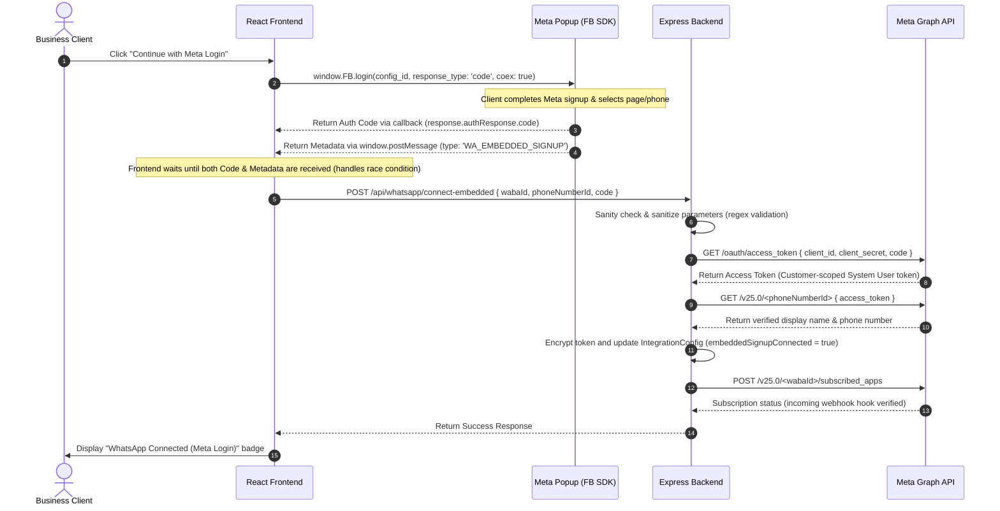

# Meta Onboarding Setup & Integration Audit: WhatsApp Coexistence Login

This document outlines the detailed configuration requirements in the **Meta Developer Portal**, the **Server Environment Variables (`.env`)**, and an **Architecture Audit** explaining how the connection flow works under the hood.

---

## 1. Meta Developer Portal Dashboard Configuration

To enable the WhatsApp Embedded Signup with Coexistence on your domain, you must configure **Facebook Login for Business** within your Meta App Dashboard.

### Step 1: Add Facebook Login for Business to Your App
1. Log in to [developers.facebook.com](https://developers.facebook.com) and click **My Apps**.
2. Select your registered App.
3. In the left sidebar, click **Add Product** (or search for products) and select **Facebook Login for Business** (Setup).

### Step 2: Configure Client OAuth Settings
1. Navigate to **Facebook Login for Business > Settings** in the left sidebar.
2. Under **Client OAuth settings**, enable the following toggles:
   - **Client OAuth login**: `Yes`
   - **Web OAuth login**: `Yes`
   - **Enforce HTTPS**: `Yes` (Required for secure production connections)
   - **Embedded Browser OAuth Login**: `Yes`
   - **Login with the JavaScript SDK**: `Yes`
3. Under **Allowed Domains for the JavaScript SDK**, add your fully qualified frontend domains:
   - `https://app.adfliker.com`
   - (Add any local development/staging domains, e.g. `https://localhost:3000` or `https://127.0.0.1:3000`)
4. Under **Valid OAuth Redirect URIs**, add:
   - `https://app.adfliker.com/`
   - `https://app.adfliker.com/api/meta/callback` (used for standard Meta Lead Sync OAuth redirects)

### Step 3: Create a Login Configuration
1. Navigate to **Facebook Login for Business > Configurations** in the left sidebar.
2. Click **+ Create Configuration** (or Edit your existing one).
3. Set a name for the configuration (e.g., `CRM WhatsApp Onboarding`).
4. **Choose Permissions**: Add the following permissions to request from the user during signup:
   - `whatsapp_business_management` (Required to manage WABA assets and configure webhooks)
   - `whatsapp_business_messaging` (Required to send messages via the Cloud API)
5. **WhatsApp Settings**: Select the features you want to enable. Ensure the configuration version is set to **v4** (the latest version recommended by Meta, as older versions are scheduled for deprecation).
6. Copy the generated **Configuration ID** (a long numeric string, e.g., `5232664493539170`).

---

## 2. Server Environment Configuration (`.env`)

Add or update the following values in your server's `.env` configuration file:

```ini
# Meta App Credentials (Retrieve from Settings > Basic in Meta App Dashboard)
META_APP_ID=978612311487105
META_APP_SECRET=your_app_secret_here

# WhatsApp Embedded Signup Configuration (Retrieve from Facebook Login for Business > Configurations)
WA_EMBEDDED_CONFIG_ID=5232664493539170

# Webhook Security
WA_WEBHOOK_VERIFY_TOKEN=mysecretpassword123
```

---

## 3. Hard Audit: How the Connection Works Under the Hood

The implementation follows a secure, race-condition-free dual-path onboarding strategy. Here is exactly how the frontend and backend interact:



### Detailed Flow Analysis

#### A. Frontend Handling (Vite React Client)
1. **Dynamic Initialization**: When the client loads WhatsApp settings, the component checks if `config.metaAppId` exists. If so, it dynamically mounts `https://connect.facebook.net/en_US/sdk.js` to the page and initializes it.
2. **FB.login Integration**:
   - `featureType: 'whatsapp_business_app_onboarding'` is set.
   - `coex: true` is passed. This enables coexistence, allowing the client to continue using their mobile WhatsApp Business App.
3. **Race Condition Prevention**:
   - The login popup returns the **authorization code** inside the `FB.login` callback.
   - The popup posts the **WABA ID** and **Phone Number ID** to the window via a cross-domain message.
   - The React component listens for `message` events, checks `event.origin` to ensure security (trusts only `facebook.com`), and holds both outputs in a combined state. The backend call is only triggered once both pieces are fully resolved.

#### B. Backend Handling (Express Server)
1. **Secure Exchange**: The backend receives the short-lived authorization code. It calls `https://graph.facebook.com/v25.0/oauth/access_token` alongside the secure `META_APP_SECRET` to trade it for a permanent customer-scoped System User Token.
2. **Validation & Storage**: The backend makes a Graph API request to fetch the display phone number and name. It encrypts the token using the server's master `ENCRYPTION_KEY` and updates the `IntegrationConfig` collection, storing `embeddedSignupConnected = true` to demarcate the Meta Login path from the manual pathway.
3. **Automatic Webhook Subscription**: The backend registers the client WABA to the app: `POST /v25.0/<wabaId>/subscribed_apps`. This triggers Meta to start routing incoming messaging events to your callback URL: `https://app.adfliker.com/webhook/whatsapp`.

---

## 4. Troubleshooting: App Review & Roles ("Partner app lacks required advanced permissions" error)

If you see the following error inside the Meta Login popup:
> **"Partner app lacks required advanced WhatsApp Business management and messaging permissions for onboarding. Request these permissions through the app review process."**

This happens because the Meta App is in Development Mode (or has only Standard/Basic Access permissions) and the Facebook user account performing the onboarding has not been added to your Meta App's developer team list.

### How to resolve for Development/Testing (Immediate Fix)
1. Go to [developers.facebook.com](https://developers.facebook.com) and select your App.
2. In the left sidebar, navigate to **App Roles > Roles**.
3. Click **Add Developers** or **Add Testers**.
4. Enter the Facebook Name, Profile URL, or Facebook ID of the account you are logging into in the popup.
5. Log into that Facebook account, go to [developers.facebook.com/requests](https://developers.facebook.com/requests), and **Accept** the pending Developer/Tester invitation.
6. Refresh the CRM settings page and retry the Meta Login button. The onboarding popup will now complete successfully.

### How to resolve for Production (Before public launch)
To onboard external clients whose Facebook accounts are not in your developer team list, you must request **Advanced Access** from Meta:
1. In the Meta App Dashboard, go to **App Review > Permissions and Features**.
2. Locate `whatsapp_business_management` and click **Request Advanced Access**.
3. Locate `whatsapp_business_messaging` and click **Request Advanced Access**.
4. Submit a brief screen recording showcasing how your CRM WhatsApp feature operates. Once Meta reviews and approves it, any business user worldwide can onboard without the error.
