# Adfliker Partner Integration — Official Documentation

**Version:** 1.0  
**Last Updated:** 2026-09-07  
**Audience:** Platform SuperAdmin · Integration Partners · Partner Development Teams

---

## Table of Contents

1. [Overview](#1-overview)
2. [Architecture & Flow Diagram](#2-architecture--flow-diagram)
3. [SuperAdmin Setup (Creating a Partner)](#3-superadmin-setup-creating-a-partner)
4. [Partner API Reference (`/api/partner/v1`)](#4-partner-api-reference)
   - [Authentication](#41-authentication)
   - [Account Management](#42-account-management)
   - [Embed Token & iframe](#43-embed-token--iframe)
   - [WhatsApp Configuration](#44-whatsapp-configuration)
   - [WhatsApp Messaging](#45-whatsapp-messaging)
   - [WhatsApp Conversations](#46-whatsapp-conversations)
   - [Webhook Management](#47-webhook-management)
   - [Analytics](#48-analytics)
5. [Embedding WhatsApp in Your CRM (iframe Guide)](#5-embedding-whatsapp-in-your-crm)
6. [Webhook Events & Signature Verification](#6-webhook-events--signature-verification)
7. [Billing & Invoicing](#7-billing--invoicing)
8. [Rate Limiting](#8-rate-limiting)
9. [Module Access Control](#9-module-access-control)
10. [Security Model](#10-security-model)
11. [Changes Required in the Partner's Software](#11-changes-required-in-the-partners-software)
12. [Error Reference](#12-error-reference)
13. [FAQ & Troubleshooting](#13-faq--troubleshooting)

---

## 1. Overview

The Adfliker Partner Integration allows third-party CRM applications (e.g., a car-dealer CRM, a real-estate CRM, or any SaaS platform) to **embed Adfliker's WhatsApp module** directly into their own product. Partners never log into Adfliker directly — instead, they use a server-to-server API to provision accounts and generate embed tokens, and their end-users interact with WhatsApp through a seamless embedded iframe.

### What Partners Get

| Capability | Description |
|---|---|
| **Embedded WhatsApp Inbox** | Full WhatsApp inbox UI embedded as an iframe inside the partner's CRM |
| **Account Provisioning API** | Create, freeze, unfreeze, and manage sub-accounts programmatically |
| **WhatsApp Messaging API** | Send text messages and template messages via API |
| **WhatsApp Configuration API** | Connect/disconnect WhatsApp credentials per account |
| **Conversation & Template Access** | Read conversations, messages, and list templates |
| **Real-time Webhooks** | Receive inbound messages, delivery status updates, and account lifecycle events |
| **Analytics** | Conversation and message volume statistics |

### How Billing Works

Billing is **manual** and handled by the Adfliker SuperAdmin:

1. The SuperAdmin sets a `pricePerAccount` per month when creating the partner
2. Each month, the SuperAdmin generates a bill: **active accounts × price = invoice amount**
3. The partner pays offline (bank transfer, UPI, etc.)
4. The SuperAdmin marks the bill as "paid" in the system

No automated payments or subscription billing is involved.

---

## 2. Architecture & Flow Diagram

### 2.1 End-to-End Integration Flow

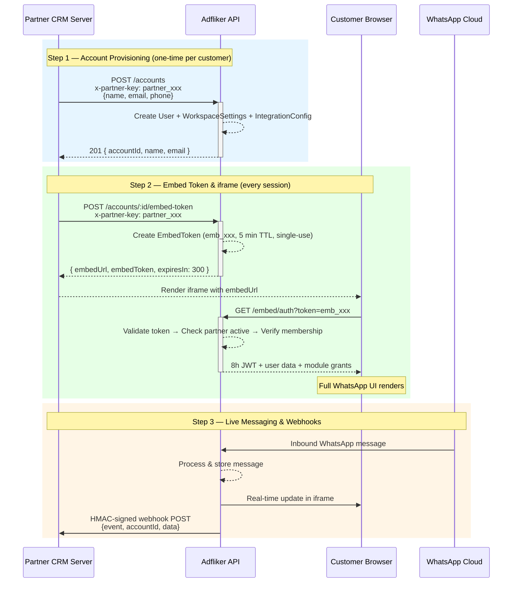

### 2.2 System Component Overview

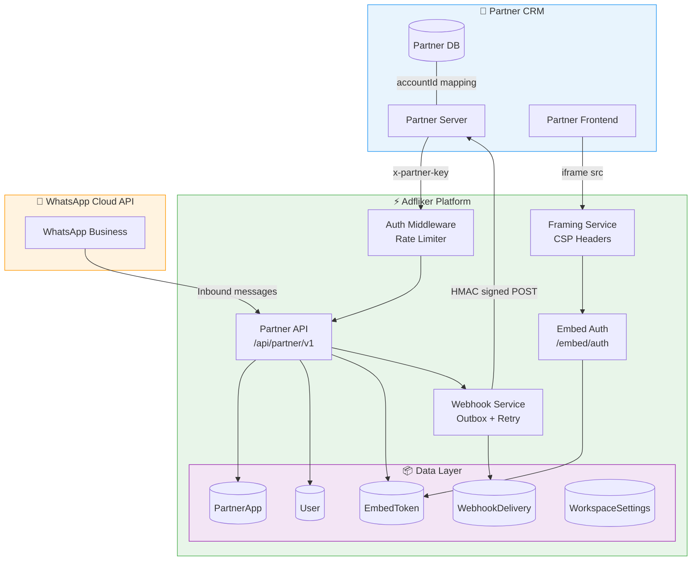

### 2.3 Account Provisioning Flow (Detailed)

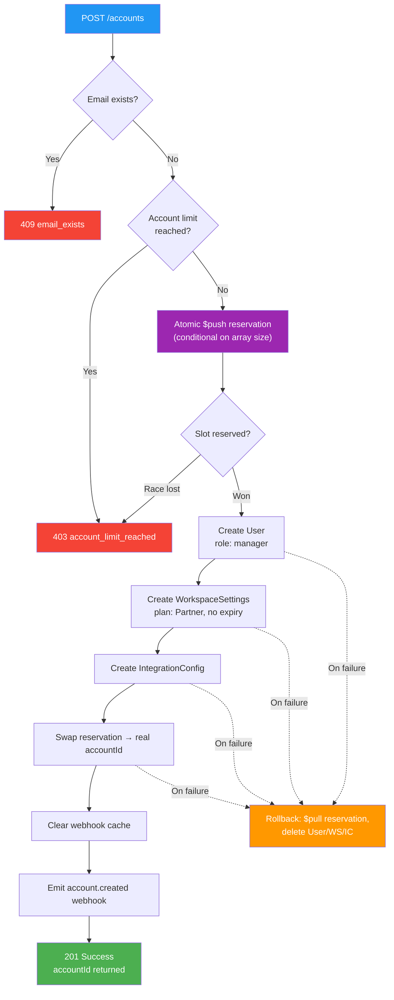

---

## 3. SuperAdmin Setup (Creating a Partner)

Before a partner can use the API, the Adfliker **SuperAdmin** must create them in the system.

### 3.1 Creating a Partner App

**Navigate to:** SuperAdmin → Partner Apps → Create New Partner

The SuperAdmin fills in:

| Field | Required | Description |
|---|---|---|
| `appName` | ✅ | Display name (e.g., "AutoDealer CRM") |
| `contactPerson` | | Primary contact person's name |
| `contactEmail` | | Contact email for communication |
| `contactPhone` | | Contact phone number |
| `pricePerAccount` | | Monthly price per active account (e.g., ₹500) |
| `currency` | | One of: `INR`, `USD`, `EUR`, `GBP`, `AED` |
| `maxAccounts` | | Maximum sub-accounts the partner can provision (default: 100) |
| `allowedModules` | | Which modules the partner's customers can access in the embed |
| `allowedOrigins` | ✅ | Exact origins that may iframe the embed (e.g., `https://app.partner.com`) |
| `accountDefaults.leadLimit` | | Lead limit per provisioned account (default: 500) |
| `accountDefaults.agentLimit` | | Agent limit per provisioned account (default: 3) |
| `accountDefaults.activeModules` | | Modules activated on each new account (default: `['leads', 'whatsapp']`) |
| `rateLimit.perAccountPerMinute` | | API calls per minute, per account (default: 30) |
| `rateLimit.perAccountPerDay` | | API calls per day, per account (default: 500) |
| `rateLimit.floor` | | Minimum rate limit even with 0 accounts (default: 30) |
| `allowDirectLogin` | | If `true`, provisioned account passwords are returned to the partner |
| `showPoweredBy` | | Show "Powered by Adfliker" banner in the embed (default: `true`) |

### 3.2 Credentials Generated at Creation

On creation, the system generates two critical secrets that are **shown exactly once**:

| Credential | Format | Purpose |
|---|---|---|
| **API Key** | `partner_<48 hex chars>` | Authenticates all Partner API calls via `x-partner-key` header |
| **Webhook Signing Secret** | `whsec_<48 hex chars>` | Used to verify HMAC-SHA256 signatures on incoming webhooks |

> [!CAUTION]
> **Both values are shown only at creation time and can never be retrieved again.** The API key is stored as a SHA-256 hash — only the first 12 characters (prefix) are kept for display. Copy and securely store both values immediately.

### 3.3 Configuring Embed Origins

The `allowedOrigins` field controls which domains can embed the WhatsApp iframe. This is a security-critical setting:

- Must be exact `scheme://host[:port]` values (e.g., `https://app.mycrm.com`)
- Wildcards are **never** accepted (to prevent clickjacking)
- An empty list means the embed is frameable by **nobody**
- Both `http` and `https` schemes are accepted, but `https` is strongly recommended

**Example:**
```json
["https://app.mycrm.com", "https://staging.mycrm.com"]
```

### 3.4 Partner Management (Post-Creation)

The SuperAdmin can manage partners through four tabs:

| Tab | Actions |
|---|---|
| **Accounts** | View all provisioned accounts, freeze/unfreeze/delete individual accounts |
| **Billing** | Generate monthly bills, mark as paid/due, view billing history with invoice numbers |
| **Settings** | Edit partner configuration (modules, pricing, origins, webhooks, rate limits) |
| **API Key** | View masked key, regenerate key, rotate webhook secret, view API usage chart |

---

## 4. Partner API Reference

### Base URL

```
https://<adfliker-domain>/api/partner/v1
```

### 4.1 Authentication

Every request (except embed token exchange) requires the `x-partner-key` header:

```http
x-partner-key: partner_<your-api-key>
```

**Error responses:**

| Status | Error Code | Meaning |
|---|---|---|
| `401` | `invalid_partner_key` | Missing, malformed, or unrecognized key |
| `403` | `partner_deactivated` | The partner app has been deactivated by the platform admin |

---

### 4.2 Account Management

#### Create Account

Provisions a new sub-account for one of your customers.

```http
POST /api/partner/v1/accounts
x-partner-key: partner_xxx
Content-Type: application/json

{
  "name": "John Doe",
  "email": "john@example.com",
  "phone": "+919876543210",
  "companyName": "John's Auto"
}
```

| Field | Required | Description |
|---|---|---|
| `name` | ✅ | Customer's display name |
| `email` | ✅ | Unique email — becomes the login identity |
| `phone` | | Customer's phone number |
| `companyName` | | Company/business name |

**Response (201):**
```json
{
  "success": true,
  "data": {
    "accountId": "66abc123def4567890ab1234",
    "name": "John Doe",
    "email": "john@example.com",
    "companyName": "John's Auto"
  }
}
```

If `allowDirectLogin` is enabled, the response also includes `password` and `loginUrl`.

**Error Codes:**
- `409` — `email_exists`: An account with this email already exists
- `403` — `account_limit_reached`: Maximum account cap reached

> [!NOTE]
> **Provisioning is atomic.** If any step fails, everything rolls back automatically — the email is freed for retry. The account cap is enforced atomically in the database to prevent race conditions from concurrent provisioning calls.

---

#### List Accounts

```http
GET /api/partner/v1/accounts?page=1&limit=50
x-partner-key: partner_xxx
```

**Query Parameters:**
- `page` (default: 1)
- `limit` (default: 50, max: 200)

**Response (200):**
```json
{
  "success": true,
  "data": [
    {
      "accountId": "66abc...",
      "name": "John Doe",
      "email": "john@example.com",
      "companyName": "John's Auto",
      "phone": "+919876543210",
      "status": "Active",
      "whatsappConnected": true,
      "createdAt": "2026-09-01T10:00:00.000Z"
    }
  ],
  "total": 12,
  "page": 1,
  "pages": 1
}
```

---

#### Get Account Details

```http
GET /api/partner/v1/accounts/:accountId
x-partner-key: partner_xxx
```

**Response (200):**
```json
{
  "success": true,
  "data": {
    "accountId": "66abc...",
    "name": "John Doe",
    "email": "john@example.com",
    "companyName": "John's Auto",
    "phone": "+919876543210",
    "status": "Active",
    "whatsapp": {
      "connected": true,
      "displayPhone": "+91 98765 43210",
      "embeddedSignup": false
    },
    "modules": ["leads", "whatsapp"],
    "createdAt": "2026-09-01T10:00:00.000Z"
  }
}
```

---

#### Update Account

```http
PATCH /api/partner/v1/accounts/:accountId
x-partner-key: partner_xxx
Content-Type: application/json

{
  "name": "John D.",
  "companyName": "John's Premium Auto"
}
```

**Editable fields:** `name`, `phone`, `companyName`  
**Not editable:** `email` (it is the login identity)

---

#### Freeze Account

Suspends the account — the user cannot log in or use the embed.

```http
PUT /api/partner/v1/accounts/:accountId/freeze
x-partner-key: partner_xxx
```

**Effect:** Sets `accountStatus: 'Frozen'`, revokes all active sessions immediately. Emits `account.frozen` webhook.

---

#### Unfreeze Account

```http
PUT /api/partner/v1/accounts/:accountId/unfreeze
x-partner-key: partner_xxx
```

**Effect:** Restores `accountStatus: 'Active'`, access is restored immediately. Emits `account.frozen` webhook with `status: 'Active'`.

---

### 4.3 Embed Token & iframe

This is the core mechanism for embedding WhatsApp in your CRM. The flow is:

1. **Your server** requests a short-lived embed token
2. **Your frontend** loads an iframe with the embed URL
3. **The iframe** exchanges the token for a JWT session and renders the WhatsApp UI

#### Generate Embed Token

```http
POST /api/partner/v1/accounts/:accountId/embed-token
x-partner-key: partner_xxx
```

**Response (200):**
```json
{
  "success": true,
  "embedToken": "emb_a1b2c3d4e5f6...",
  "embedUrl": "https://app.adfliker.com/embed/whatsapp?token=emb_a1b2c3d4e5f6...",
  "expiresIn": 300
}
```

**Token Properties:**
- **Lifetime:** 5 minutes (auto-deleted from DB via MongoDB TTL)
- **Single-use:** Can only be exchanged once — subsequent attempts fail
- **Scoped:** Bound to the specific account and partner

> [!WARNING]
> **Generate a fresh token every time the user opens the WhatsApp panel.** Tokens expire after 5 minutes and cannot be reused. Never cache embed tokens.

#### Embed Token Exchange (Browser-Side)

This endpoint is called automatically by the embedded iframe — partners do not call it directly.

```http
GET /api/partner/v1/embed/auth?token=emb_xxx
```

No `x-partner-key` required — the token itself authenticates the request.

**Checks performed:**
1. Token exists and hasn't expired (5-minute TTL)
2. Token hasn't been used before (single-use)
3. Partner is still active
4. Account still belongs to the partner
5. User account is active (not frozen)

**Returns:** An 8-hour JWT session + user data with module grants.

---

### 4.4 WhatsApp Configuration

These endpoints require the `x-account-id` header or an `:accountId` route parameter.

#### Connect WhatsApp

```http
POST /api/partner/v1/whatsapp/connect
x-partner-key: partner_xxx
x-account-id: 66abc...
Content-Type: application/json

{
  "phoneNumberId": "1234567890",
  "accessToken": "EAAG...",
  "wabaId": "9876543210",
  "businessId": "111222333",
  "appId": "444555666",
  "appSecret": "abc123..."
}
```

| Field | Required | Description |
|---|---|---|
| `phoneNumberId` | ✅ | WhatsApp Phone Number ID from Meta Business |
| `accessToken` | ✅ | Permanent access token from Meta |
| `wabaId` | | WhatsApp Business Account ID |
| `businessId` | | Meta Business ID |
| `appId` | | Meta App ID |
| `appSecret` | | Meta App Secret |

#### Get WhatsApp Config

```http
GET /api/partner/v1/whatsapp/config
x-partner-key: partner_xxx
x-account-id: 66abc...
```

#### Disconnect WhatsApp

```http
DELETE /api/partner/v1/whatsapp/disconnect
x-partner-key: partner_xxx
x-account-id: 66abc...
```

---

### 4.5 WhatsApp Messaging

#### Send Text Message

```http
POST /api/partner/v1/whatsapp/send
x-partner-key: partner_xxx
x-account-id: 66abc...
Content-Type: application/json

{
  "phone": "+919876543210",
  "message": "Hello! Your appointment is confirmed for tomorrow at 3 PM."
}
```

#### Send Template Message

```http
POST /api/partner/v1/whatsapp/template
x-partner-key: partner_xxx
x-account-id: 66abc...
Content-Type: application/json

{
  "phone": "+919876543210",
  "templateName": "appointment_reminder",
  "languageCode": "en_US",
  "variables": ["John", "3 PM", "Tomorrow"]
}
```

#### List Templates

```http
GET /api/partner/v1/whatsapp/templates?status=APPROVED
x-partner-key: partner_xxx
x-account-id: 66abc...
```

Returns templates in all statuses by default. Pass `?status=APPROVED` for only sendable templates.

---

### 4.6 WhatsApp Conversations

#### List Conversations

```http
GET /api/partner/v1/whatsapp/conversations?status=active&page=1&limit=50
x-partner-key: partner_xxx
x-account-id: 66abc...
```

#### Get Conversation Messages

```http
GET /api/partner/v1/whatsapp/conversations/:conversationId/messages?page=1&limit=50
x-partner-key: partner_xxx
x-account-id: 66abc...
```

Messages are returned oldest-first for chat display.

---

### 4.7 Webhook Management

#### Get Webhook Config

```http
GET /api/partner/v1/webhook
x-partner-key: partner_xxx
```

**Response:**
```json
{
  "success": true,
  "data": {
    "url": "https://api.mycrm.com/webhooks/adfliker",
    "events": ["message.received", "message.status_update"],
    "hasSecret": true
  }
}
```

#### Update Webhook Config

```http
PUT /api/partner/v1/webhook
x-partner-key: partner_xxx
Content-Type: application/json

{
  "url": "https://api.mycrm.com/webhooks/adfliker",
  "events": ["message.received", "message.status_update", "account.created"]
}
```

- `url` must be an `https://` URL. Private/loopback addresses are rejected (SSRF protection).
- Set `url` to `null` or `""` to disable webhooks.
- The webhook signing secret is generated automatically the first time a URL is set, and is returned **only on that first call**.

#### Rotate Webhook Signing Secret

```http
POST /api/partner/v1/webhook/rotate-secret
x-partner-key: partner_xxx
```

**Response:**
```json
{
  "success": true,
  "data": {
    "secret": "whsec_abc123...",
    "message": "Store this signing secret now — it is not returned again."
  }
}
```

> [!IMPORTANT]
> The old secret stops working **immediately**. Update your webhook verification code before rotating.

---

### 4.8 Analytics

#### WhatsApp Analytics

```http
GET /api/partner/v1/analytics/whatsapp
x-partner-key: partner_xxx
x-account-id: 66abc...
```

**Response:**
```json
{
  "success": true,
  "data": {
    "totalConversations": 156,
    "totalMessages": 4823,
    "messagesLast30Days": 892
  }
}
```

---

## 5. Embedding WhatsApp in Your CRM

### 5.1 How the Embed Works

The embed system uses a **token-exchange pattern** to securely authenticate iframe sessions:

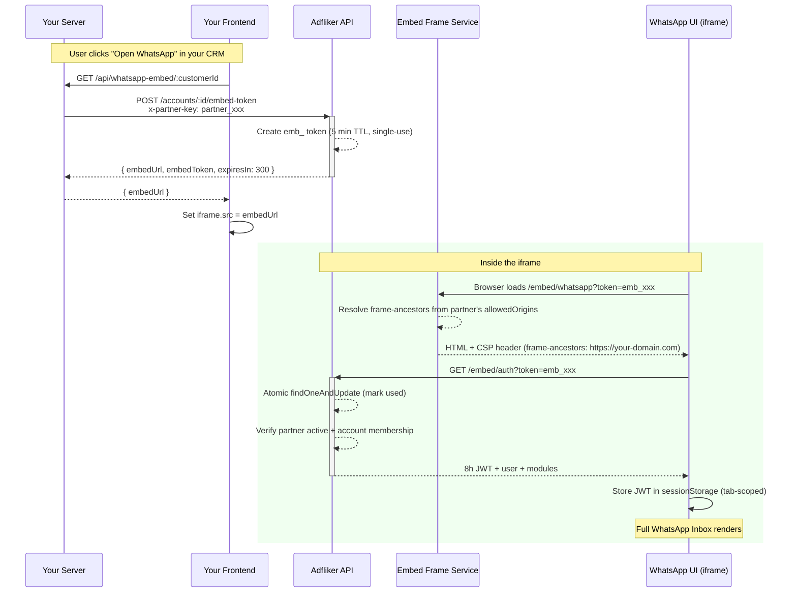

**Embed Token Lifecycle:**

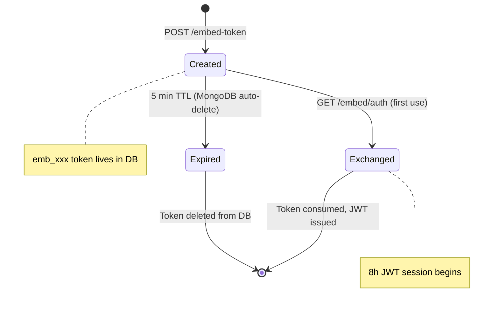

### 5.2 Frontend Implementation (Partner Side)

**Step 1: Backend endpoint to generate embed tokens**

```javascript
// Your backend (e.g., Express.js)
app.get('/api/whatsapp-embed/:customerId', async (req, res) => {
  const customer = await Customer.findById(req.params.customerId);
  
  const response = await fetch(
    'https://app.adfliker.com/api/partner/v1/accounts/'
      + customer.adflikerAccountId + '/embed-token',
    {
      method: 'POST',
      headers: {
        'x-partner-key': process.env.ADFLIKER_PARTNER_KEY
      }
    }
  );
  
  const data = await response.json();
  res.json({ embedUrl: data.embedUrl });
});
```

**Step 2: Render the iframe in your frontend**

```html
<!-- In your CRM's customer detail page -->
<div id="whatsapp-container" style="width: 100%; height: 600px;">
  <iframe
    id="whatsapp-embed"
    src=""
    style="width: 100%; height: 100%; border: none;"
    allow="clipboard-write"
  ></iframe>
</div>

<script>
  async function loadWhatsApp(customerId) {
    const res = await fetch(`/api/whatsapp-embed/${customerId}`);
    const data = await res.json();
    document.getElementById('whatsapp-embed').src = data.embedUrl;
  }
  
  // Call when user opens the WhatsApp tab/panel
  loadWhatsApp('customer_123');
</script>
```

**React Example:**

```jsx
import { useState, useEffect } from 'react';

function WhatsAppEmbed({ customerId }) {
  const [embedUrl, setEmbedUrl] = useState(null);
  const [loading, setLoading] = useState(true);

  useEffect(() => {
    async function fetchEmbedUrl() {
      try {
        const res = await fetch(`/api/whatsapp-embed/${customerId}`);
        const data = await res.json();
        setEmbedUrl(data.embedUrl);
      } catch (err) {
        console.error('Failed to load WhatsApp embed:', err);
      } finally {
        setLoading(false);
      }
    }
    fetchEmbedUrl();
  }, [customerId]);

  if (loading) return <div>Loading WhatsApp...</div>;
  if (!embedUrl) return <div>Failed to load WhatsApp</div>;

  return (
    <iframe
      src={embedUrl}
      style={{ width: '100%', height: '600px', border: 'none' }}
      allow="clipboard-write"
      title="WhatsApp"
    />
  );
}
```

**Python (Flask) Backend Example:**

```python
import requests, os

@app.route('/api/whatsapp-embed/<customer_id>')
def get_embed_url(customer_id):
    customer = db.customers.find_one({'_id': customer_id})
    account_id = customer['adfliker_account_id']
    
    resp = requests.post(
        f'https://app.adfliker.com/api/partner/v1/accounts/{account_id}/embed-token',
        headers={'x-partner-key': os.environ['ADFLIKER_PARTNER_KEY']}
    )
    data = resp.json()
    return {'embedUrl': data['embedUrl']}
```

**PHP Backend Example:**

```php
// GET /api/whatsapp-embed/{customerId}
$customer = Customer::find($customerId);
$accountId = $customer->adfliker_account_id;

$ch = curl_init("https://app.adfliker.com/api/partner/v1/accounts/{$accountId}/embed-token");
curl_setopt($ch, CURLOPT_POST, true);
curl_setopt($ch, CURLOPT_HTTPHEADER, [
    'x-partner-key: ' . env('ADFLIKER_PARTNER_KEY')
]);
curl_setopt($ch, CURLOPT_RETURNTRANSFER, true);
$response = json_decode(curl_exec($ch));
curl_close($ch);

return response()->json(['embedUrl' => $response->embedUrl]);
```

### 5.3 Embed UI Features

The embedded WhatsApp UI includes (based on module grants):

| Module | What it includes |
|---|---|
| `whatsapp` | Full inbox — conversations, messaging, media, agent assignment |
| `whatsapp_templates` | Template management — view, use, and create WhatsApp templates |
| `whatsapp_broadcasts` | Broadcast campaigns — send template messages to multiple contacts |
| `whatsapp_chatbot` | Chatbot flow builder — create automated conversation flows |
| `whatsapp_analytics` | Analytics dashboard — message volumes, response times, agent performance |

### 5.4 Session Behavior

- **Session duration:** 8 hours (JWT expiry)
- **Session storage:** `sessionStorage` (tab-scoped, isolated from the host CRM)
- **Token refresh:** Embed sessions are never auto-renewed; generate a new token after 8 hours
- **Isolation:** The embed session is fully isolated from any Adfliker session in other tabs

### 5.5 "Powered by Adfliker" Banner

If `showPoweredBy` is enabled for the partner, a slim banner appears at the top of the embed:

```
┌────────────────────────────────────────────────────┐
│ Powered by Adfliker          Integrated with MyApp │
├────────────────────────────────────────────────────┤
│                                                    │
│            Full WhatsApp UI renders here           │
│                                                    │
└────────────────────────────────────────────────────┘
```

Set `showPoweredBy: false` in the partner settings to remove it.

---

## 6. Webhook Events & Signature Verification

### 6.1 Available Events

| Event | Trigger | Payload |
|---|---|---|
| `message.received` | Inbound WhatsApp message from a customer | Message content, sender phone, conversation ID |
| `message.status_update` | Message delivery status change (sent/delivered/read/failed) | Message ID, status, timestamp |
| `account.created` | New account provisioned via API | Account ID, name, email, company name |
| `account.frozen` | Account frozen or unfrozen (by partner API or platform admin) | Account ID, new status (`Frozen` or `Active`) |
| `account.deleted` | Account deleted by platform admin | Account ID, name, email |

### 6.2 Webhook Payload Format

```json
{
  "event": "message.received",
  "accountId": "66abc123def4567890ab1234",
  "timestamp": "2026-09-07T14:30:00.000Z",
  "data": {
    "messageId": "wamid.xxx",
    "from": "+919876543210",
    "type": "text",
    "text": "Hello, I need help with my order"
  }
}
```

### 6.3 Webhook Headers

Every webhook delivery includes these headers:

| Header | Description |
|---|---|
| `Content-Type` | `application/json` |
| `User-Agent` | `Adfliker-PartnerWebhook/1.0` |
| `X-Partner-Signature` | HMAC-SHA256 hex digest of the JSON body |
| `X-Partner-Event` | Event type (e.g., `message.received`) |
| `X-Partner-Delivery-Id` | Unique delivery ID (format: `whd_<32 hex>`) — use for deduplication |
| `X-Partner-Attempt` | Attempt number (1 = first delivery, 2+ = retries) |

### 6.4 Signature Verification

Verify every webhook to ensure it genuinely came from Adfliker:

**Node.js:**
```javascript
const crypto = require('crypto');

function verifyWebhookSignature(rawBody, signature, secret) {
  const expected = crypto
    .createHmac('sha256', secret)
    .update(rawBody)   // the RAW JSON string, not a parsed object
    .digest('hex');
  
  return crypto.timingSafeEqual(
    Buffer.from(signature),
    Buffer.from(expected)
  );
}

// In your webhook handler:
app.post('/webhooks/adfliker', express.raw({ type: 'application/json' }), (req, res) => {
  const signature = req.headers['x-partner-signature'];
  const isValid = verifyWebhookSignature(req.body.toString(), signature, WEBHOOK_SECRET);
  
  if (!isValid) {
    return res.status(401).json({ error: 'Invalid signature' });
  }
  
  const event = JSON.parse(req.body);
  // Process the event...
  
  res.status(200).json({ received: true });
});
```

**Python:**
```python
import hmac
import hashlib

def verify_webhook(raw_body: bytes, signature: str, secret: str) -> bool:
    expected = hmac.new(
        secret.encode('utf-8'),
        raw_body,
        hashlib.sha256
    ).hexdigest()
    return hmac.compare_digest(expected, signature)
```

**PHP:**
```php
function verifyWebhook($rawBody, $signature, $secret) {
    $expected = hash_hmac('sha256', $rawBody, $secret);
    return hash_equals($expected, $signature);
}
```

### 6.5 Delivery Guarantees & Retries

Webhooks have **durable delivery** with automatic retries:

| Attempt | Delay | Total Time |
|---|---|---|
| 1 | Immediate (inline) | 0 min |
| 2 | 1 minute | 1 min |
| 3 | 5 minutes | 6 min |
| 4 | 15 minutes | 21 min |
| 5 | 1 hour | 1h 21m |
| 6 | 6 hours | 7h 21m |

**Webhook Delivery Flow:**

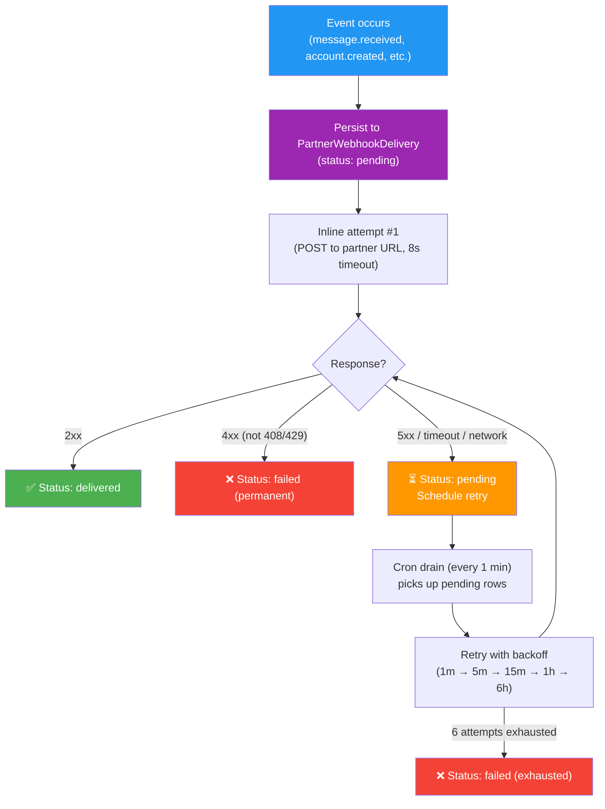

**Retry behavior:**
- Every event is persisted **before** the first delivery attempt — events survive server restarts
- HTTP 4xx responses (except 408 and 429) are treated as **permanent failures** — no further retries
- HTTP 5xx, timeouts, and network errors are **retried** on the schedule above
- After 6 failed attempts, the delivery is marked as `failed`
- The `X-Partner-Delivery-Id` header is the same across retries — use it for deduplication
- Delivery logs are visible in the SuperAdmin webhook tab and auto-purge after 30 days

> [!TIP]
> **Your webhook endpoint should respond within 8 seconds.** Longer responses are treated as timeouts. Process heavy work asynchronously and return 200 immediately.

### 6.6 Deduplication

Use the `X-Partner-Delivery-Id` header to deduplicate. In rare cases (e.g., ambiguous timeout on attempt 1, followed by a retry), you may receive the same event twice. The delivery ID is the same across all attempts for the same event.

```javascript
// Store processed delivery IDs (Redis SET with TTL, or DB)
const processedIds = new Set(); // Use Redis in production

app.post('/webhooks/adfliker', (req, res) => {
  const deliveryId = req.headers['x-partner-delivery-id'];
  
  if (processedIds.has(deliveryId)) {
    return res.status(200).json({ duplicate: true });
  }
  
  processedIds.add(deliveryId);
  // Process event...
  res.status(200).json({ received: true });
});
```

---

## 7. Billing & Invoicing

### 7.1 Billing Model

| Aspect | Detail |
|---|---|
| **Pricing** | Fixed monthly rate per **active** account (`pricePerAccount`) |
| **Billing unit** | Each active, non-frozen account counts as 1 unit |
| **Billing cycle** | Monthly, manually generated by the SuperAdmin |
| **Invoice format** | `INV-YYYY-MM-NNNN` (sequential per partner) |
| **Payment method** | Offline (bank transfer, UPI, etc.) |
| **Currency** | Frozen at invoice time — a later currency change does not restate history |

### 7.2 What Counts as a "Billable Account"

An account is billable if:
- `is_active` is `true` **AND**
- `accountStatus` is NOT `'Frozen'` **AND**
- The account was created **before** the billing period ended

### 7.3 Invoice Lifecycle

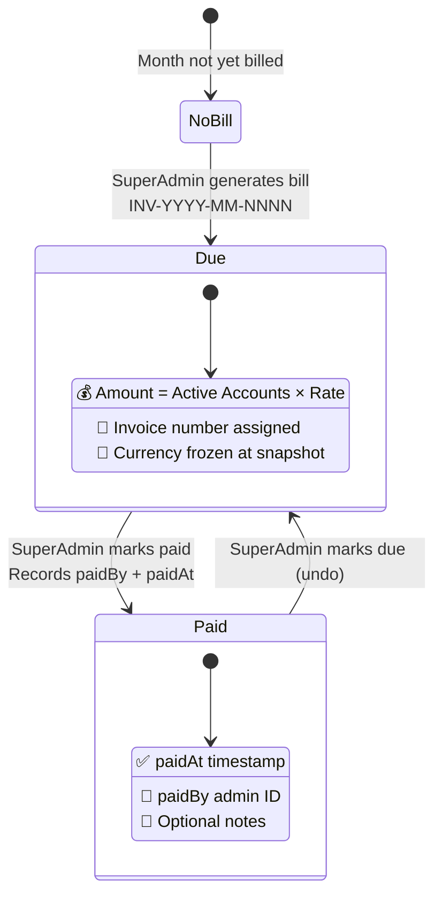

**Monthly Billing Flow:**

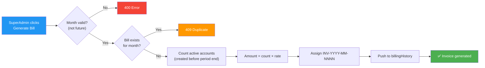

### 7.4 Revenue Calculation

```
Monthly Revenue = Active Accounts × Price Per Account
```

This formula is consistent across:
- The partner list view
- The partner detail view
- The generated invoice

---

## 8. Rate Limiting

### 8.1 How Rate Limits Work

Rate limits are **dynamic** and scale with the number of provisioned accounts:

```
Effective Per-Minute Limit = max(floor, accountCount × perAccountPerMinute)
Effective Daily Limit      = max(floor × 48, accountCount × perAccountPerDay)
```

**Rate Limit Scaling:**

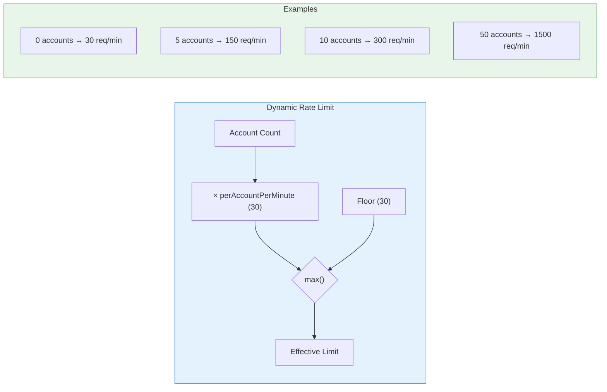

**Request Flow Through Rate Limiter:**

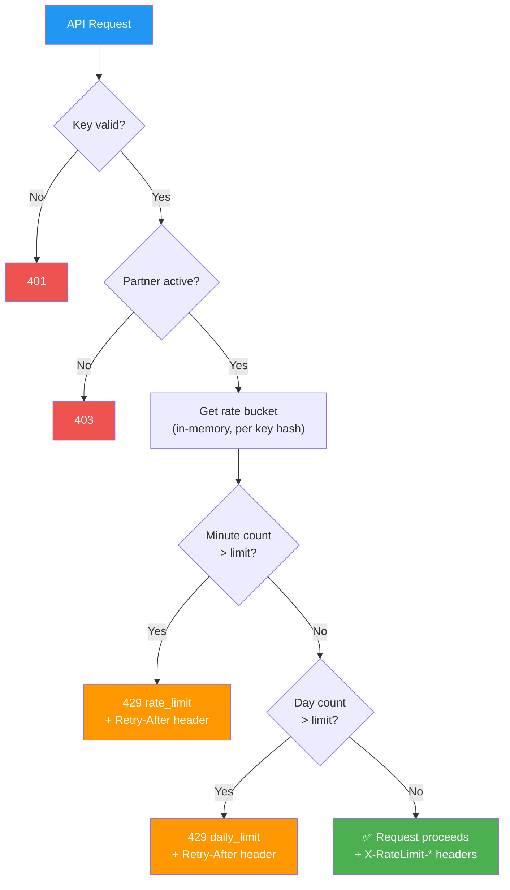

**Default configuration:**

| Parameter | Default | Description |
|---|---|---|
| `perAccountPerMinute` | 30 | Requests per minute, per account |
| `perAccountPerDay` | 500 | Requests per day, per account |
| `floor` | 30 | Minimum even with 0 accounts |

**Example:** A partner with 10 accounts gets `max(30, 10 × 30) = 300` req/min.

### 8.2 Rate Limit Headers

Every response includes these headers:

| Header | Description |
|---|---|
| `X-RateLimit-Limit` | Current effective limit (per minute) |
| `X-RateLimit-Remaining` | Requests remaining in the current window |
| `X-RateLimit-Reset` | Unix timestamp when the window resets |
| `X-RateLimit-Account-Count` | Number of provisioned accounts |
| `X-RateLimit-Per-Account` | Configured per-account-per-minute rate |

### 8.3 Exceeding the Limit

**HTTP 429 response:**
```json
{
  "success": false,
  "error": "rate_limit",
  "message": "Rate limit exceeded. Your limit is 300 req/min (10 accounts × 30/min).",
  "limit": 300,
  "accountCount": 10,
  "perAccount": 30
}
```

The `Retry-After` header indicates how many seconds to wait.

---

## 9. Module Access Control

### 9.1 How Modules Are Controlled

There are **two layers** of module control:

1. **`allowedModules`** (Partner-level): Which modules the partner is allowed to resell. Configured by the SuperAdmin.
2. **`accountDefaults.activeModules`** (Account-level): Which modules each provisioned account actually gets activated.

The embed UI shows only the intersection — modules that are both allowed for the partner AND active on the account.

### 9.2 Available Modules

| Module Key | Description |
|---|---|
| `whatsapp` | WhatsApp inbox (conversations, messaging) |
| `whatsapp_templates` | WhatsApp message template management |
| `whatsapp_broadcasts` | Bulk message broadcasting |
| `whatsapp_chatbot` | Chatbot flow builder |
| `whatsapp_analytics` | WhatsApp analytics dashboard |
| `leads` | Lead management (CRM) |
| `email` | Email module |
| `automations` | Workflow automations |
| `reports` | Reports and dashboards |

### 9.3 Module Enforcement

Modules are enforced at **two levels**:

1. **JWT signing:** The `embedModules` claim in the JWT carries the partner's allowed modules, signed so the client cannot widen its own grant.
2. **Server-side clamping:** `authMiddleware` reads `embedModules` from the JWT and clamps the session's effective modules to that list.

---

## 10. Security Model

### 10.1 Authentication Architecture

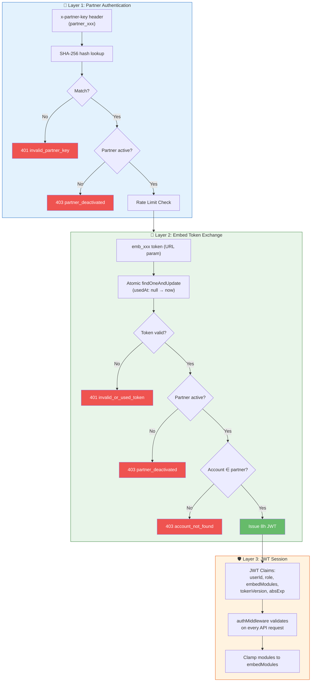

### 10.2 Key Security Properties

| Property | Implementation |
|---|---|
| **API key storage** | SHA-256 hash only — no plaintext in DB |
| **API key rotation** | Instant cutover — old key stops working immediately |
| **Embed token single-use** | Atomic `findOneAndUpdate` with `usedAt: null` guard |
| **Embed token TTL** | MongoDB TTL index auto-deletes after 5 minutes |
| **iframe framing** | Per-partner `Content-Security-Policy: frame-ancestors` allowlist |
| **No wildcards** | `frame-ancestors *` is never produced |
| **Session isolation** | Embed sessions use `sessionStorage` (tab-scoped), separate keys |
| **SSRF protection** | Webhook URLs validated: must be `https://`, private/loopback rejected |
| **Webhook signatures** | HMAC-SHA256 on every delivery |
| **Module enforcement** | Signed in JWT, clamped server-side |
| **Partner deactivation** | Blocks API + kills all embed sessions + blocks new token exchanges |
| **Account freeze** | Bumps `tokenVersion` to invalidate all live JWTs instantly |
| **Provisioning atomicity** | Atomic slot reservation + compensating rollback on failure |
| **Ownership enforcement** | Every account-scoped operation verifies `accountId ∈ partner.accountIds` |

### 10.3 What "Deactivating a Partner" Does

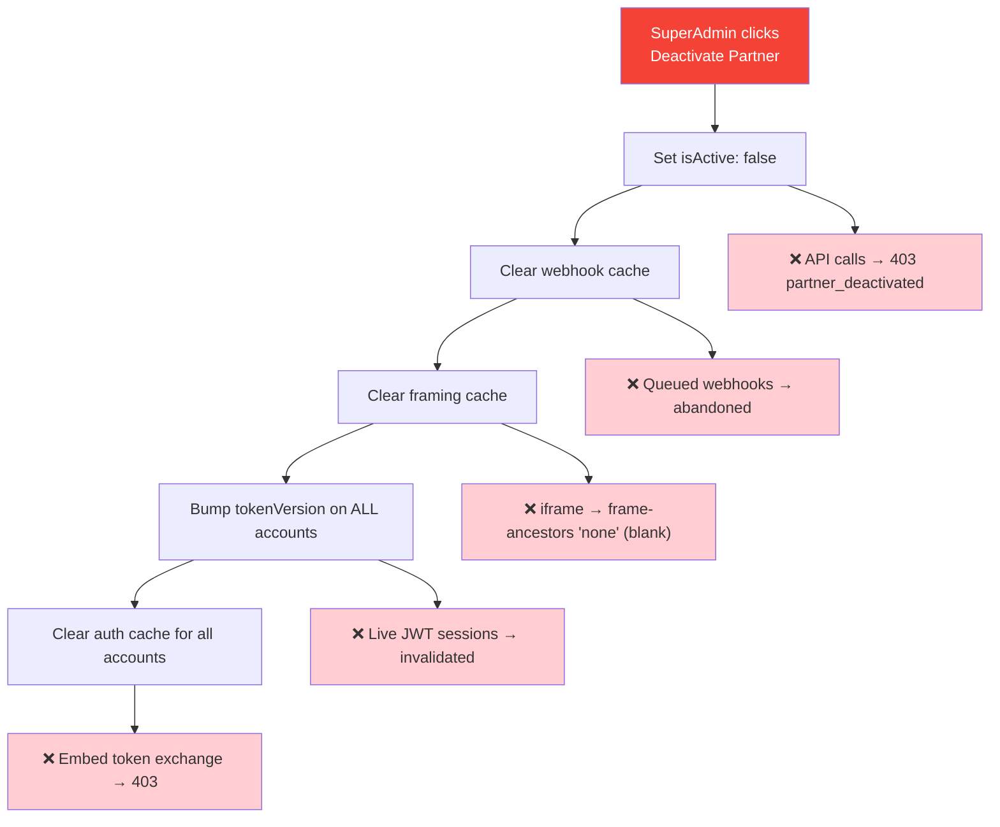

When the SuperAdmin deactivates a partner:

1. ✅ All API calls with `x-partner-key` return `403 partner_deactivated`
2. ✅ Pending embed tokens cannot be exchanged (`exchangeEmbedToken` checks `partner.isActive`)
3. ✅ All live embed sessions are revoked (bumps `tokenVersion` on every account)
4. ✅ The iframe goes blank (framing cache is cleared, `frame-ancestors` becomes `'none'`)
5. ✅ Queued webhook deliveries are abandoned

---

## 11. Changes Required in the Partner's Software

### 11.1 Backend Changes

| Change | Description | Priority |
|---|---|---|
| **Store API credentials** | Securely store the `partner_xxx` API key and `whsec_xxx` webhook secret | 🔴 Critical |
| **Account mapping** | Store the Adfliker `accountId` alongside each customer record in your DB | 🔴 Critical |
| **Embed token endpoint** | Create a backend endpoint that calls Adfliker's embed-token API and returns the `embedUrl` to your frontend | 🔴 Critical |
| **Webhook endpoint** | Create an HTTPS endpoint to receive webhook events, with signature verification | 🟡 High |
| **Account provisioning** | Call `POST /accounts` when a new customer signs up (or on-demand) | 🟡 High |
| **Error handling** | Handle `409 email_exists`, `403 account_limit_reached`, `429 rate_limit` gracefully | 🟡 High |

### 11.2 Frontend Changes

| Change | Description | Priority |
|---|---|---|
| **iframe container** | Add an iframe element to your customer detail / messaging page | 🔴 Critical |
| **Token fetching** | On opening the WhatsApp panel, fetch a fresh embed URL from your backend | 🔴 Critical |
| **Loading state** | Show a spinner while the iframe loads and authenticates | 🟢 Nice-to-have |
| **Error state** | Show an error message if the iframe fails to load | 🟢 Nice-to-have |

### 11.3 Infrastructure Changes

| Change | Description | Priority |
|---|---|---|
| **HTTPS webhook endpoint** | Your webhook URL must be `https://` — HTTP is rejected | 🔴 Critical |
| **Register your domain** | Tell the Adfliker SuperAdmin your embed origin (e.g., `https://app.mycrm.com`) so it's added to `allowedOrigins` | 🔴 Critical |
| **Webhook processing queue** | Process webhook events asynchronously — respond within 8 seconds | 🟡 High |

### 11.4 Minimal Integration Checklist

```
□ 1. Receive API key and webhook secret from Adfliker admin
□ 2. Store both securely (environment variables, secrets manager)
□ 3. Provide your embed origin URL to Adfliker admin
□ 4. Build backend endpoint: POST /accounts → Adfliker API (account provisioning)
□ 5. Build backend endpoint: GET /embed-url → Adfliker API (embed token generation)
□ 6. Add iframe to your frontend (load from embed URL)
□ 7. Build webhook endpoint with HMAC signature verification
□ 8. Test end-to-end: provision account → embed WhatsApp → send/receive message → verify webhook
□ 9. Go live 🚀
```

---

## 12. Error Reference

### Standard Error Response Format

```json
{
  "success": false,
  "error": "error_code",
  "message": "Human-readable explanation."
}
```

### Error Codes

| HTTP | Error Code | Description |
|---|---|---|
| `400` | `missing_account_id` | `x-account-id` header or `:accountId` param required |
| `400` | `account_id_conflict` | `x-account-id` doesn't match `:accountId` in the URL |
| `400` | `invalid_token` | Missing or malformed embed token |
| `400` | `invalid_webhook_url` | Webhook URL failed validation (not HTTPS, private IP, etc.) |
| `400` | `unknown_webhook_event` | Unrecognized event name in the events array |
| `401` | `invalid_partner_key` | Missing, malformed, or unrecognized API key |
| `401` | `invalid_or_used_token` | Embed token is expired, invalid, or already used |
| `403` | `partner_deactivated` | Partner app has been deactivated |
| `403` | `account_not_found` | Account doesn't belong to this partner |
| `403` | `account_inactive` | The target account is frozen or inactive |
| `403` | `account_limit_reached` | Maximum account cap reached |
| `409` | `email_exists` | An account with this email already exists |
| `429` | `rate_limit` | Per-minute rate limit exceeded |
| `429` | `daily_limit` | Per-day rate limit exceeded |

---

## 13. FAQ & Troubleshooting

### Q: The iframe shows a blank/white page

**Causes:**
1. Your domain is not in the partner's `allowedOrigins`. Contact the SuperAdmin to add it.
2. The embed token has expired (5-minute window). Generate a fresh one.
3. The partner has been deactivated.

**Debug:** Open browser DevTools → Console. Look for CSP `frame-ancestors` violations or 401/403 responses.

---

### Q: Embed token exchange returns "partner_deactivated"

The partner app has been deactivated by the platform admin. Contact the Adfliker SuperAdmin.

---

### Q: I get "email_exists" when provisioning

An account with that email already exists (possibly from a previous provisioning or a direct signup). Each email is globally unique. Use a different email or contact the SuperAdmin to delete the existing account.

---

### Q: Webhook signature verification fails

1. Ensure you're verifying against the **raw JSON body string**, not a re-serialized object
2. Check that you're using the correct signing secret (secrets rotate on explicit action)
3. The signature covers the exact bytes sent — middleware that parses the body before you read the raw bytes will break verification

---

### Q: How long does an embed session last?

8 hours. After that, the user sees an error and must re-open the panel (which triggers a new embed token request from your backend).

---

### Q: Can I use HTTP (not HTTPS) for webhooks?

No. Webhook URLs must use `https://`. This is enforced server-side.

---

### Q: What happens if my webhook endpoint is down?

Events are retried automatically: 1 min → 5 min → 15 min → 1 hour → 6 hours (6 attempts total over ~7 hours). Events are never lost — they're persisted before the first attempt and visible in the delivery log.

---

### Q: Can the partner's customer also log in directly to Adfliker?

Only if `allowDirectLogin` is enabled for the partner. In that case, the account's password is returned during provisioning. By default, partner accounts are embed-only.

---

### Q: How do I test the integration locally?

1. Set up `allowedOrigins` to include `http://localhost:3000` (or your local dev port)
2. Use the Partner API key to provision a test account
3. Generate an embed token and load the iframe locally
4. For webhooks, use a tool like [ngrok](https://ngrok.com) to expose your local endpoint over HTTPS

---

*This document is maintained by the Adfliker platform team. For integration support, contact the SuperAdmin or reach out to the development team.*
